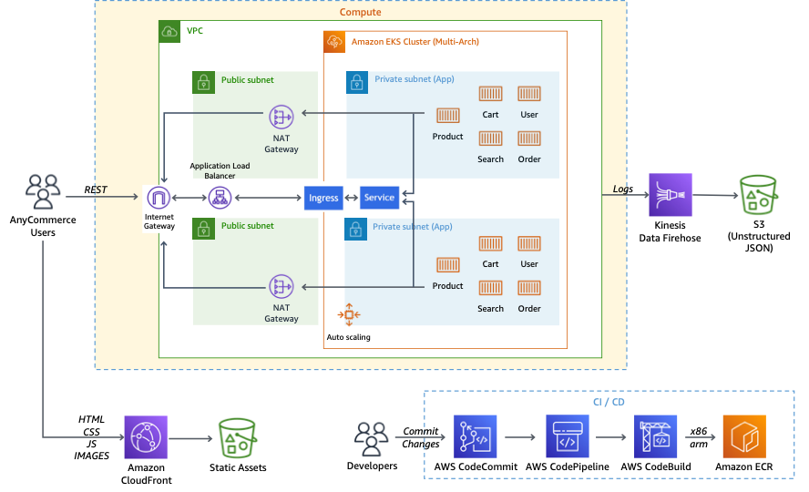

## AnyCommerce
E-Commerce demo application.

### Resources
* Terraform(`/terraform`) codes to create AWS resources including EKS cluster for anycommerce.
* Application source codes (`/src`).
* Helm Chart(`/charts`) to deploy applications using Helm chart.

## Architecture

## Requirements
This is required during installation.
* Terraform (required_version = ">= 1.2.0")
* Helm

## Instructions
1. Create terraform using Terraform(`/terraform`) codes. See instructions in `/terraform/README.md`
2. (Optional) Upload application source codes(`/src`) to [CodeCommit](https://ap-northeast-2.console.aws.amazon.com/codesuite/codecommit/repositories?region=ap-northeast-2) `main` branch. See instructions in `/src/README.md`. 
3. Deploy applications using Helm Chart(`/charts`). See instructions in `/charts/README.md`
